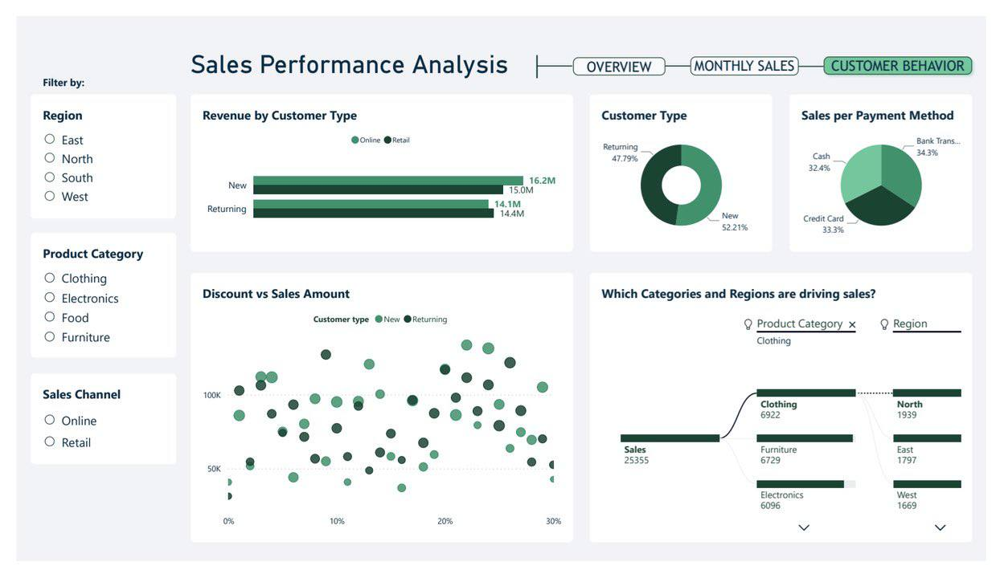
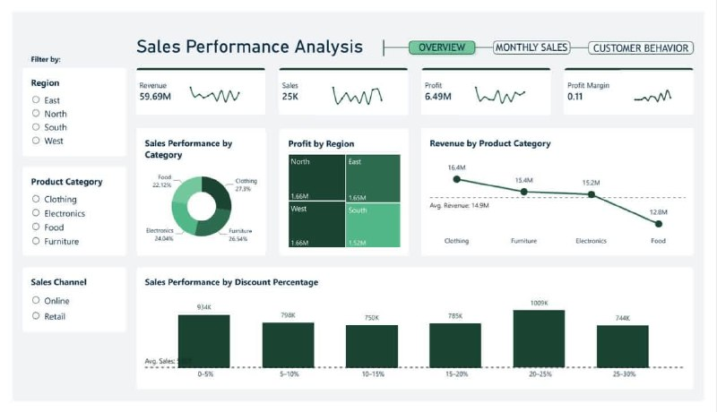
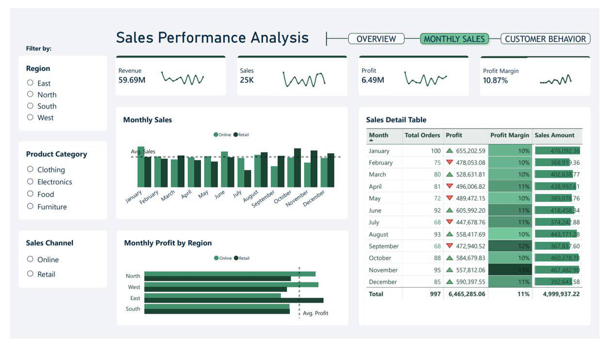

# 📊 Sales Performance & Customer Behavior Analysis

## 🎯 Project Overview
This project is a comprehensive **Business Intelligence (BI)** solution designed to analyze sales performance, track profitability, and uncover deep insights into customer behavior. 
The primary objective of this analysis is to empower decision-makers with actionable, data-driven insights to optimize discount strategies, improve customer retention, and maximize overall revenue across different regions and product categories.

**Key Achievements highlighted in this project:**
*   Analyzed a large dataset generating **$59.69M in Revenue** and **$6.49M in Profit**.
*   Conducted root-cause analysis using advanced visualization techniques to identify primary sales drivers.
*   Evaluated the impact of pricing and discount strategies on sales volume and profit margins.

---

## 🛠️ Tools & Skills Demonstrated
*   **Data Visualization & BI:** Power BI 
*   **Data Analysis:** Exploratory Data Analysis (EDA), Trend Analysis, Cohort & Customer Segmentation.
*   **Business Acumen:** KPIs definition (Revenue, Profit Margin, Customer Retention Rate), Pricing Strategy Evaluation.
*   **Advanced Visuals:** Decomposition Trees (for root-cause analysis), Scatter Plots (for correlation), Matrix with conditional formatting.

---

## 📈 Dashboard Deep Dive & Business Insights

### 1. Executive Overview: Performance at a Glance
This section provides high-level executives with immediate visibility into the company's health.

<!-- ⬇️ ضَع رابط الصورة الثالثة (Overview) هنا ⬇️ -->

**🔍 Analytical Insights:**
*   **Category Dominance:** The 'Clothing' category leads in sales performance, while 'Food' requires strategic intervention due to lower revenue contribution.
*   **Discount Strategy Evaluation:** The analysis reveals a critical insight: **Discounts between 20-25% drive the highest sales volume (1.009K)**. This indicates high price elasticity among the customer base, but requires careful monitoring to ensure profit margins are not cannibalized.
*   **Regional Profitability:** Profit is relatively well-distributed across regions, showing a balanced market penetration, with the North region slightly leading.

### 2. Monthly Sales & Profitability Trends
This view is designed for operational managers to track monthly seasonality and channel performance.

<!-- ⬇️ ضَع رابط الصورة الأولى (Monthly Sales) هنا ⬇️ -->

**🔍 Analytical Insights:**
*   **Channel Comparison:** By splitting metrics into 'Online' vs. 'Retail', we observed distinct purchasing patterns over the year, allowing for targeted inventory allocation.
*   **Profit Margin Tracking:** The detailed matrix table utilizes conditional formatting to instantly highlight underperforming months (e.g., February, April, May, July) where profit margins dipped below the target.
*   **Seasonality:** The data shows clear peaks in specific months, suggesting the need for proactive supply chain management and targeted marketing campaigns prior to these peaks.

### 3. Customer Behavior & Driver Analysis
Understanding the customer is key to sustainable growth. This view dives deep into who is buying and what drives their decisions.

<!-- ⬇️ ضَع رابط الصورة الثانية (Customer Behavior) هنا ⬇️ -->

**🔍 Analytical Insights:**
*   **Customer Acquisition vs. Retention:** The customer base is healthy, with **52.21% New vs. 47.79% Returning** customers. However, 'Returning' customers show a very strong presence in Online sales.
*   **Discount vs. Sales Volume Correlation:** The scatter plot illustrates the relationship between discounts given and sales volume generated, clustered by customer type. This helps in understanding if new customers are strictly discount-driven compared to returning loyalists.
*   **Advanced Root-Cause Analysis (Decomposition Tree):** Used to drill down into the 25K total sales. The analysis statistically proves that the **Clothing category in the North Region** is the single largest driver of the company's sales volume.

---

## 💡 Strategic Recommendations
Based on the data analysis, I propose the following business actions:
1.  **Optimize the 20-25% Discount Tier:** Since this tier drives maximum volume, the company should run A/B testing on a slightly lower tier (e.g., 18-20%) to see if volume holds while increasing the overall profit margin.
2.  **Loyalty Programs for Retail:** With a slight edge in acquiring 'New' customers via retail, implementing an in-store loyalty program could successfully convert them into 'Returning' high-LTV (Life Time Value) customers.
3.  **Investigate the 'Food' Category:** A dedicated qualitative analysis is needed to understand why 'Food' lags. Re-evaluating product-market fit or adjusting the supply chain for this category is recommended.

